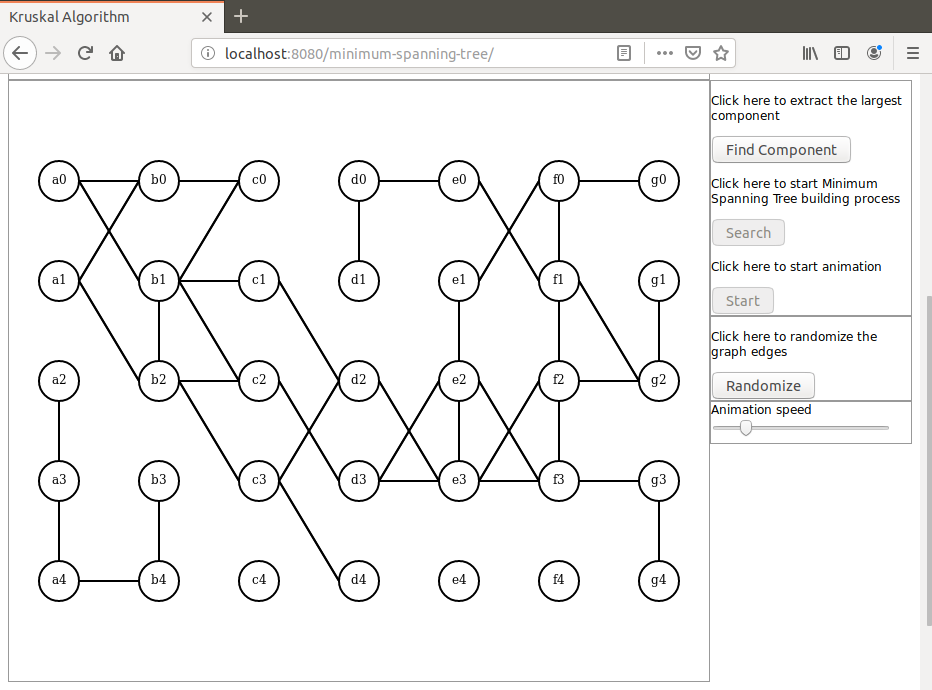
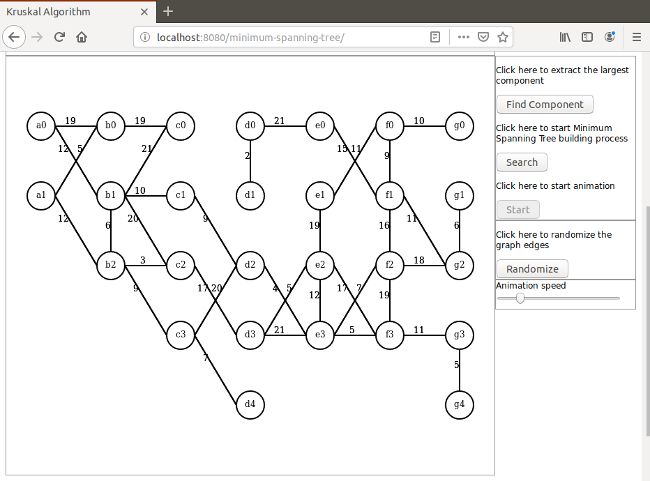
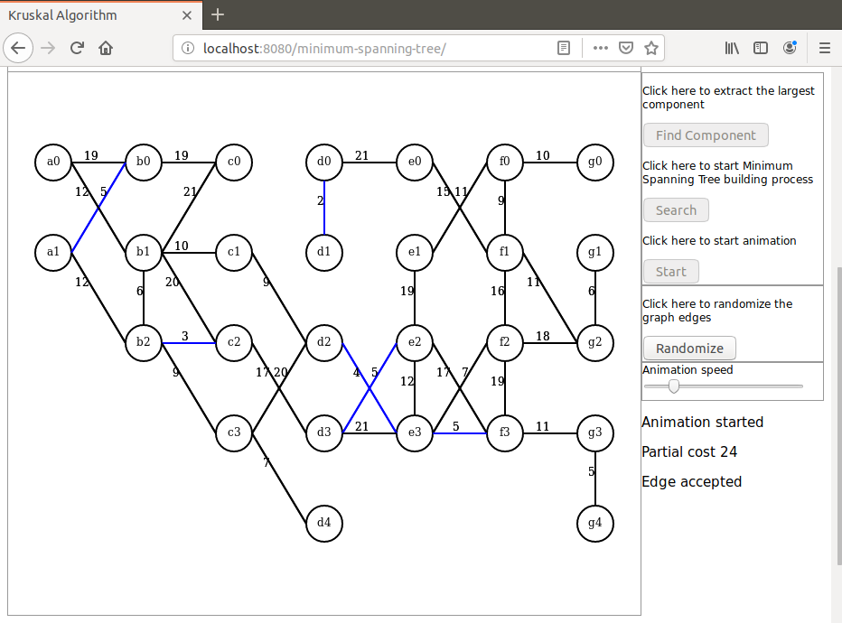
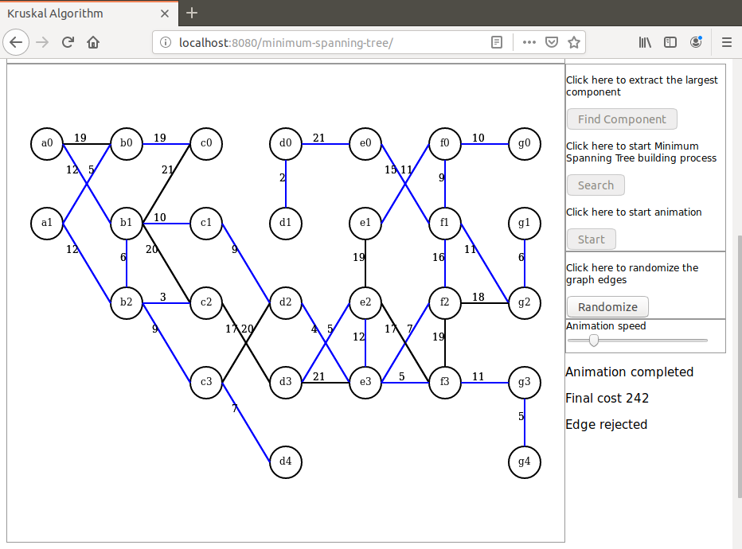

# kruskal-anim
I present here a Java based demonstration of the Minimum Spanning Tree using Kruskal algorithm.

The algorithm itself is implemented in Java, Javascript is only used for initiaization and display on Canvas.

First an undirected graph is randomly created and its largest connected component is extracted (Java side).

Then a minimum spanning tree is built (Java side) with all intermediate results saved as a collection.

This collection is then sent to the browser as a JSON object.

The collection is used for an animated display (browser side).

# Launching the demo
To launch the demo run the command `mvn spring-boot:run` in project directory. When the application has started open a browser and hit URL `localhost:8080/minimum-spanning-tree`.

Here are some screen shots that can be seen during the demo:

After the graph was initialized:

After the largest component was computed:

Animation step:

Animation completed:

For a step-by-step demonstration please visit this repository:

https://github.com/dubersfeld/kruskal-step

For a video demo follow this link:

https://youtu.be/JyIiDHzmhME

Dominique Ubersfeld, Cachan, France
